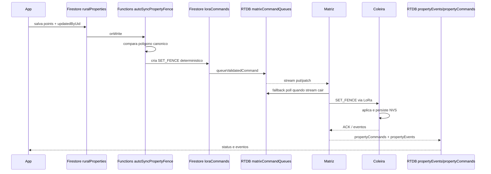
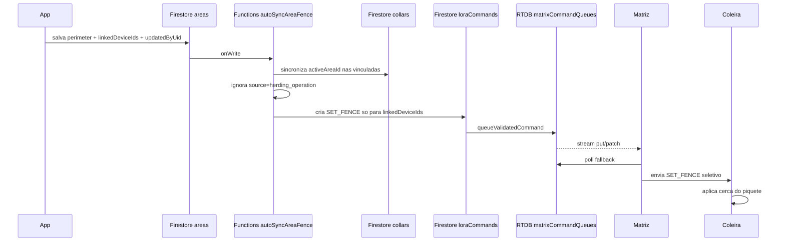
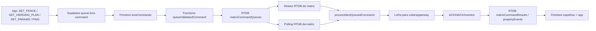
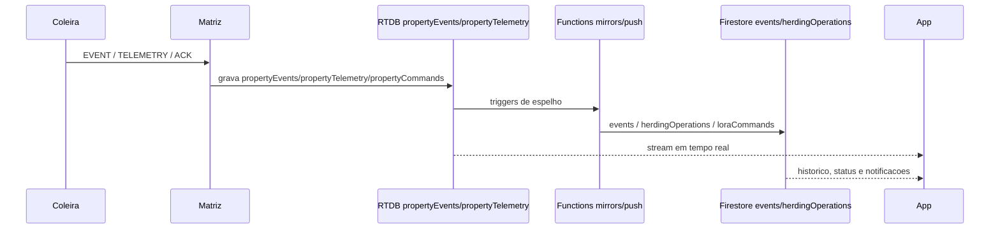

# Fluxos Atualizados de Polígonos, Fila RTDB e Eventos

## Resumo Operacional

- Cadastro de propriedade e piquete continua sendo a intenção operacional do app.
- A cerca que realmente governa violação continua sendo a cerca persistida na coleira.
- O backend agora cria `SET_FENCE` automático quando o polígono da propriedade muda.
- O backend agora cria `SET_FENCE` seletivo quando o polígono do piquete ou os `linkedDeviceIds` mudam.
- A RTDB continua sendo o barramento cloud de comandos e eventos.
- A matriz agora escuta a fila por stream RTDB e usa o polling existente como fallback.
- Eventos operacionais continuam nascendo na coleira e sendo espelhados pela matriz/backend para o app.

## Prioridade por Fluxo

| Fluxo | Origem de verdade | Camada de propagação | Destino operacional |
| --- | --- | --- | --- |
| Edição de propriedade | Firestore `ruralProperties.points` | Functions -> `loraCommands` -> `matrixCommandQueues` | Coleiras da propriedade |
| Edição de piquete | Firestore `areas.perimeter` + `areas.linkedDeviceIds` | Functions -> `loraCommands` -> `matrixCommandQueues` | Coleiras vinculadas ao piquete |
| Comando genérico do app | Firestore/Supabase queue | RTDB queue + stream da matriz + polling fallback | Coleira/gateway alvo |
| Evento operacional | Coleira | Matriz -> RTDB/Firestore | App e notificações |

## Diagramas

### 1. Propriedade -> auto `SET_FENCE`

Prioridade:
- O app continua definindo a intenção.
- O backend agora é a origem do comando automático.
- A coleira só muda de comportamento quando aplica o `SET_FENCE`.

### 2. Piquete + `linkedDeviceIds` -> auto `SET_FENCE` seletivo

Prioridade:
- `areas.linkedDeviceIds` passou a ser a fonte de verdade do vínculo do piquete.
- `collars.activeAreaId` virou espelho operacional/auditoria do vínculo.
- A cerca ativa ainda só muda após aplicação na coleira.

### 3. Comando genérico do app -> RTDB stream + polling fallback

Prioridade:
- A fila RTDB continua sendo a fonte cloud de despacho.
- O stream agora é o gatilho prioritário para despacho imediato.
- O polling antigo permanece como contingência.

### 4. Evento da coleira -> app

Prioridade:
- O evento nasce na coleira.
- A matriz publica e roteia.
- RTDB e Firestore passam a ser espelhos consumidos pelo app.
