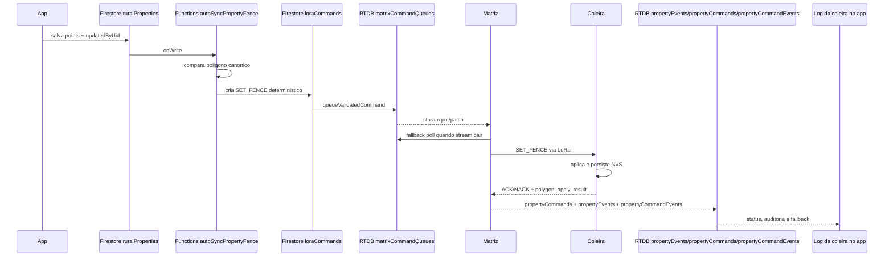
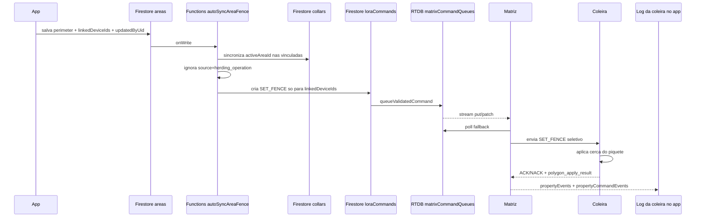
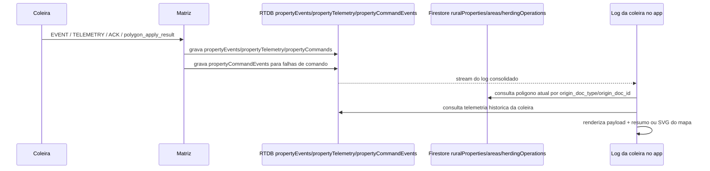

# Fluxos Atualizados de Polígonos, Fila RTDB, Auditoria e Eventos

## Resumo Operacional

- Cadastro de propriedade e piquete continua sendo a intenção operacional do app.
- A cerca que realmente governa violação continua sendo a cerca persistida na coleira.
- O backend agora cria `SET_FENCE` automático quando o polígono da propriedade muda.
- O backend agora cria `SET_FENCE` seletivo quando o polígono do piquete ou os `linkedDeviceIds` mudam.
- A RTDB continua sendo o barramento cloud de comandos e eventos.
- A matriz agora escuta a fila por stream RTDB e usa o polling existente como fallback.
- A coleira agora emite `polygon_apply_result` quando conclui com sucesso ou falha a aplicação local de polígono de fazenda, piquete ou condução.
- O log do app agora combina `propertyEvents` com `propertyCommandEvents` para não perder falhas precoces que não geraram evento auditável na coleira.
- Ao abrir um sucesso de gravação no log, o app consulta o polígono atual no Firestore, busca a posição histórica da coleira e renderiza um preview SVG dentro da própria sanfona do evento.

## Prioridade por Fluxo

| Fluxo | Origem de verdade | Camada de propagação | Destino operacional |
| --- | --- | --- | --- |
| Edição de propriedade | Firestore `ruralProperties.points` | Functions -> `loraCommands` -> `matrixCommandQueues` | Coleiras da propriedade |
| Edição de piquete | Firestore `areas.perimeter` + `areas.linkedDeviceIds` | Functions -> `loraCommands` -> `matrixCommandQueues` | Coleiras vinculadas ao piquete |
| Comando genérico do app | Firestore/Supabase queue | RTDB queue + stream da matriz + polling fallback | Coleira/gateway alvo |
| Auditoria de gravação de polígono | Coleira em sucessos/falhas aplicadas localmente; `propertyCommandEvents` em falhas precoces | Matriz -> `propertyEvents` + fallback `propertyCommandEvents` | Log da coleira no app |
| Evento operacional | Coleira | Matriz -> RTDB/Firestore | App e notificações |

## Diagramas

### 1. Propriedade -> auto `SET_FENCE`

Prioridade:
- O app continua definindo a intenção.
- O backend agora é a origem do comando automático.
- A coleira só muda de comportamento quando aplica o `SET_FENCE`.
- O evento `polygon_apply_result` é a confirmação prioritária de gravação local; o trilho de comando só cobre falhas antes desse ponto.

### 2. Piquete + `linkedDeviceIds` -> auto `SET_FENCE` seletivo

Prioridade:
- `areas.linkedDeviceIds` passou a ser a fonte de verdade do vínculo do piquete.
- `collars.activeAreaId` virou espelho operacional/auditoria do vínculo.
- A cerca ativa ainda só muda após aplicação na coleira.
- O log do app mostra sucesso/falha da gravação do piquete com payload bruto e, em caso de sucesso, preview SVG do polígono atual.

### 3. Comando genérico do app -> RTDB stream + polling fallback

```mermaid
flowchart LR
  A[App: SET_FENCE / SET_HERDING_PLAN / SET_PARAMS / PING]
    --> B[Supabase queue-lora-command]
  B --> C[Firestore loraCommands]
  C --> D[Functions queueValidatedCommand]
  D --> E[RTDB matrixCommandQueues com cmd_id e metadados de auditoria]
  E --> F[Stream RTDB da matriz]
  E --> G[Polling RTDB da matriz]
  F --> H[processNextQueuedCommand]
  G --> H
  H --> I[LoRa para coleira/gateway]
  I --> J[ACK/NACK/eventos]
  J --> K[RTDB matrixCommandResults / propertyEvents / propertyCommandEvents]
  K --> L[Firestore espelhos + app]
```

Prioridade:
- A fila RTDB continua sendo a fonte cloud de despacho.
- O stream agora é o gatilho prioritário para despacho imediato.
- O polling antigo permanece como contingência.
- `cmd_id`, `polygon_kind`, `origin_doc_type` e `origin_doc_id` acompanham o fluxo para permitir auditoria ponta a ponta.

### 4. Auditoria e evento -> app

Prioridade:
- Sucesso de gravação nasce na coleira e é a confirmação prioritária.
- Falhas muito precoces podem aparecer primeiro no `propertyCommandEvents`.
- O app usa o banco atual como fonte do polígono exibido e a telemetria histórica como fonte prioritária da posição no mini mapa.
